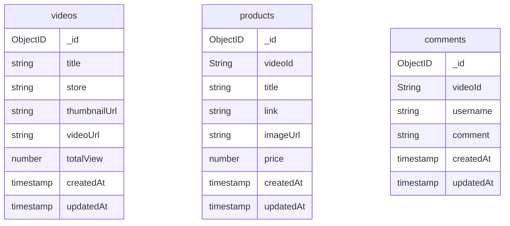

# TokoPlay Service

TokoPlay Service is a backend server built in ExpressJS and MongoDB. For the frontend can be check on [this repo](https://github.com/limglenaldin/tokopedia-play-clone-fe)

## Database Structure



## API Structure


When someone hit the endpoint, the router will call a specific Controller based on the endpoint and pass the request. On the Controller Layer, if HTTP Method POST or PUT, the request will be validate before it passed to Services Layer, else Controller will pass params and query param (if have).

In Services Layer, it will call MongoDB Model via mongoose then return the value from database. After Services Layer get value, it will return object contains errors and result.

Controller Layer will send response based on return value from the Service Layer and Router will forward to the client.

## API List

Base URL: http://localhost:5000/api/v1  
Docs URL: http://localhost:5000/api/docs (available when server has start or you can upload [`api-spec.yaml`](./doc/swagger/api-spec.yaml) to https://editor.swagger.io/)

| Endpoint             | Group                    | Resources                               | Method                        |
| -------------------- | ------------------------ | --------------------------------------- | ----------------------------- |
| /videos              | Videos API               | Index, Store, Show, Put, Patch, Destroy | GET, POST, PUT, PATCH, DELETE |
| /products            | Products API             | Index, Store, Show, Put, Destroy        | GET, POST, PUT, DELETE        |
| /videos/:id/products | Videos API, Products API | Index                                   | GET                           |
| /videos/:id/comments | Videos API, Comments API | Index, Store                            | GET, POST                     |

## Running the Server
There are two option to running the server, if you have mongodb on your local machine, you can running directly via terminal (npm). But if you haven't mongo on your local machine and you have Docker, you can running via Docker.

### Running directly via terminal (npm)
#### Prerequsite
- Have installed NodeJS v18 on the machine
- Have installed MongoDB on the machine

#### Step to Run
1. Clone the repo to your local machine
   ```
   git clone git@github.com:limglenaldin/tokopedia-play-clone.git
   ```
2. Change the directory
   ```
   cd tokopedia-play-clone
   ```
3. Create `.env` file by running `cp .env.example .env`
5. Install dependencies and start the development server
   ```
   npm install
   npm run dev
   ```
6. Finally, it can be access on `http://localhost:5000/api/v1`  
   Also you can import postman collection
   - [`TokoPlayClone.postman_collection.json`](./doc/postman/TokoPlayClone.postman_collection.json) : API Collection
   - [`TokoPlayClone Dev.postman_environment.json`](./doc/postman/TokoPlayClone%20Dev.postman_environment.json) : Env for Dev
   - [`TokoPlay Prod.postman_environment.json`](./doc/postman/TokoPlay%20Prod.postman_environment.json) : Env for Prod

### Running via Docker Compose
#### Prerequsite
- Have installed docker on the machine
- Have installed `make` on terminal (optional)

#### Step to Run
1. Clone the repo to your local machine
   ```
   git clone git@github.com:limglenaldin/tokopedia-play-clone.git
   ```
2. Change the directory
   ```
   cd tokopedia-play-clone
   ```
3. Compose Docker Container and wait until done
   ```
   docker-compose -f docker-compose.yml up --build -d
   ```
   or if has installed `make`
   ```
   make compose-up
   ```
5. Finally, it can be access on `http://localhost:5000/api/v1`  
   Also you can import postman collection
   - [`TokoPlayClone.postman_collection.json`](./doc/postman/TokoPlayClone.postman_collection.json) : API Collection
   - [`TokoPlayClone Dev.postman_environment.json`](./doc/postman/TokoPlayClone%20Dev.postman_environment.json) : Env for Dev
   - [`TokoPlay Prod.postman_environment.json`](./doc/postman/TokoPlay%20Prod.postman_environment.json) : Env for Prod


### Running via Pull Docker Image

#### Prerequsite
- Have installed docker on the machine

#### Step to Run
1. Pull docker image to your local machine
   ```
   docker pull limglenaldin/tokoplay-service
   ```
2. Create container
   ```
   docker run -d -p 5000:5000 --name tokoplay-svc limglenaldin/tokoplay-service
   ```
3. Finally, it can be access on `http://localhost:5000/api/v1`  
   Also you can import postman collection
   - [`TokoPlayClone.postman_collection.json`](./doc/postman/TokoPlayClone.postman_collection.json) : API Collection
   - [`TokoPlayClone Dev.postman_environment.json`](./doc/postman/TokoPlayClone%20Dev.postman_environment.json) : Env for Dev
   - [`TokoPlay Prod.postman_environment.json`](./doc/postman/TokoPlay%20Prod.postman_environment.json) : Env for Prod