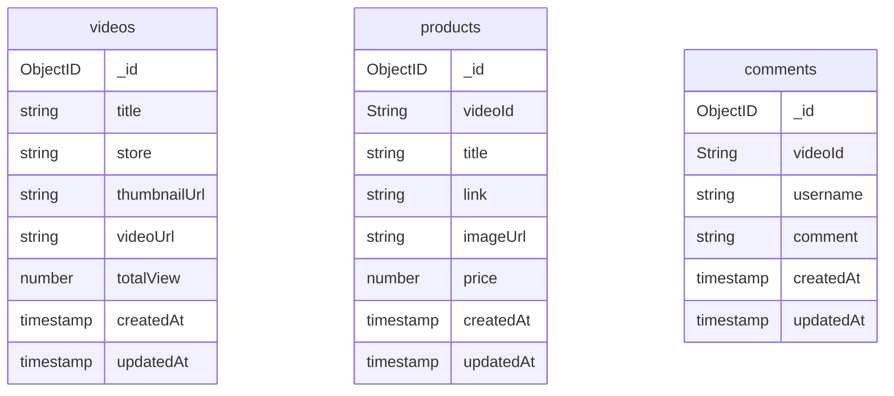

# Tokopedia Play Clone

Tokopedia Play Clone is a backend server built in ExpressJS and MongoDB.

## Database Structure

## API Structure

When someone hit the endpoint, the router will call a specific Controller based on the endpoint and pass the request. On the Controller Layer, if HTTP Method POST or PUT, the request will be validate before it passed to Services Layer, else Controller will pass params and query param (if have).

In Services Layer, it will call MongoDB Model via mongoose then return the value from database. After Services Layer get value, it will return object contains errors and result.

Controller Layer will send response based on return value from the Service Layer and Router will forward to the client.

## API List

Base URL: http://localhost:5000/api/v1  
Docs URL: http://localhost:5000/api/docs (available when server has start or you can upload /doc/swagger/api-spec.yaml to https://editor.swagger.io/)

| Endpoint             | Group                    | Resources                               | Method                        |
| -------------------- | ------------------------ | --------------------------------------- | ----------------------------- |
| /videos              | Videos API               | Index, Store, Show, Put, Patch, Destroy | GET, POST, PUT, PATCH, DELETE |
| /products            | Products API             | Index, Store, Show, Put, Destroy        | GET, POST, PUT, DELETE        |
| /videos/:id/products | Videos API, Products API | Index                                   | GET                           |
| /videos/:id/comments | Videos API, Comments API | Index, Store                            | GET, POST                     |

## Running the Server

There are two option to running the server, if you have mongodb on your local machine, you can running directly via terminal (npm). But if you haven't mongo on your local machine and you have Docker, you can running via Docker.
### Running directly via terminal (npm)

#### Prerequsite
- Have installed NodeJS v18 on the machine
- Have installed MongoDB on the machine

#### Step to Run
1. Clone this repo by running `git clone git@github.com:limglenaldin/tokopedia-play-clone.git` in your terminal
2. Change the directory by running `cd tokopedia-play-clone`
3. Create `.env` file by running `cp .env.example .env`
4. Run `npm install` to install dependencies and wait until finish
5. Run `npm run dev` to start the server
6. Open `http://localhost:5000/api/docs` on your browser to open SwaggerUI
7. Also you can import postman collection [`TokoPlayClone.postman_collection.json`](TokoPlayClone.postman_collection.json)

### Running via Docker Compose

#### Prerequsite
- Have installed docker on the machine

#### Step to Run
1. Clone this repo by running `git clone git@github.com:limglenaldin/tokopedia-play-clone.git` in your terminal
2. Change the directory by running `cd tokopedia-play-clone`
3. Run `docker-compose -f docker-compose.yml up --build -d`
   - if your machine is UNIX family you can run `make compose-up`
4. Wait until building image is done
5. Open `http://localhost:5000/api/docs` on your browser to open SwaggerUI
6. Also you can import postman collection [`TokoPlayClone.postman_collection.json`](TokoPlayClone.postman_collection.json)

### Running via Pull Docker Image

#### Prerequsite
- Have installed docker on the machine

#### Step to Run
1. Run `docker pull limglenaldin/tokoplay-service` on terminal
2. Run `docker run -d -p 5000:5000 --name tokoplay-svc limglenaldin/tokoplay-service`
3. Open `http://localhost:5000/api/docs` on your browser to open SwaggerUI
4. Also you can import postman collection [`TokoPlayClone.postman_collection.json`](TokoPlayClone.postman_collection.json)